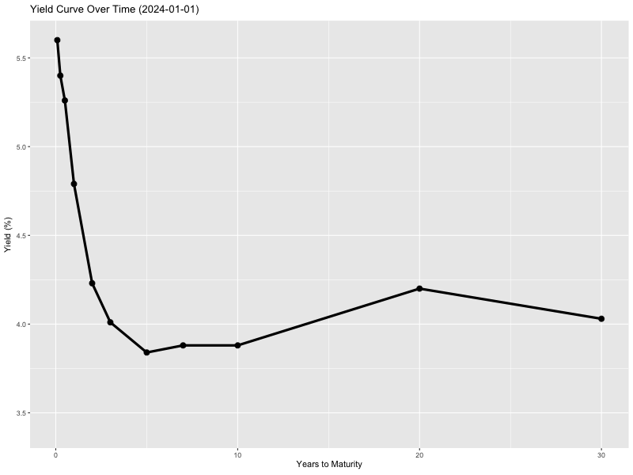

# Yield Curve Visualization 👀

This repository contains functions to visualize the yield curve using R. It includes both static and animated yield curve plotting functions.

## Contents

```
yield-curve
├── README.md
├── plots
│   ├── yield_curve.png
│   └── yield_curve_animation.gif
└── src
    ├── functions
    │   ├── plot_animated_curve.R
    │   └── plot_yield_curve.R
    └── main.R
```

- **Static Yield Curve Plot** (`plot_yield_curve.R`)
  - Plots the yield curve for a selected date and three prior dates (1-month, 2-month, and 3-month before the selected date).
  - The curve is plotted against the time to maturity in years.
  - The output is saved as a PNG file.

- **Animated Yield Curve Plot** (`plot_animated_curve.R`)
  - Generates an animated yield curve over a specified date range.
  - Uses ggplot2 and gganimate to transition between different dates.
  - The output is saved as a GIF file.


## Outputs

- **Static Yield Curve Plot:**
  - 
  
- **Animated Yield Curve:**
  - 

## Dependencies

This project requires the following R packages:
- `dplyr`
- `ggplot2`
- `gganimate`
- `DBI`
- `RPostgres`
- `jsonlite`

This repository provides an efficient way to visualize yield curve dynamics using R.